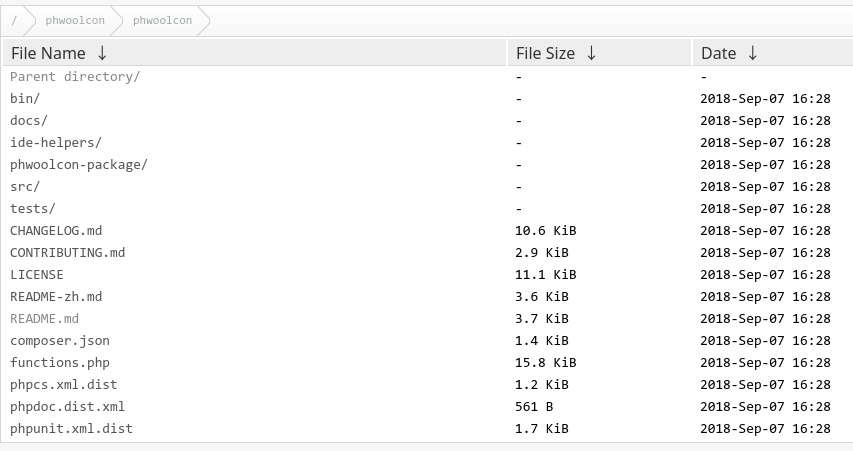
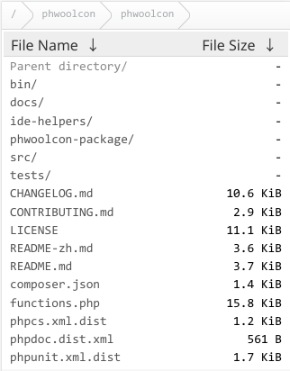
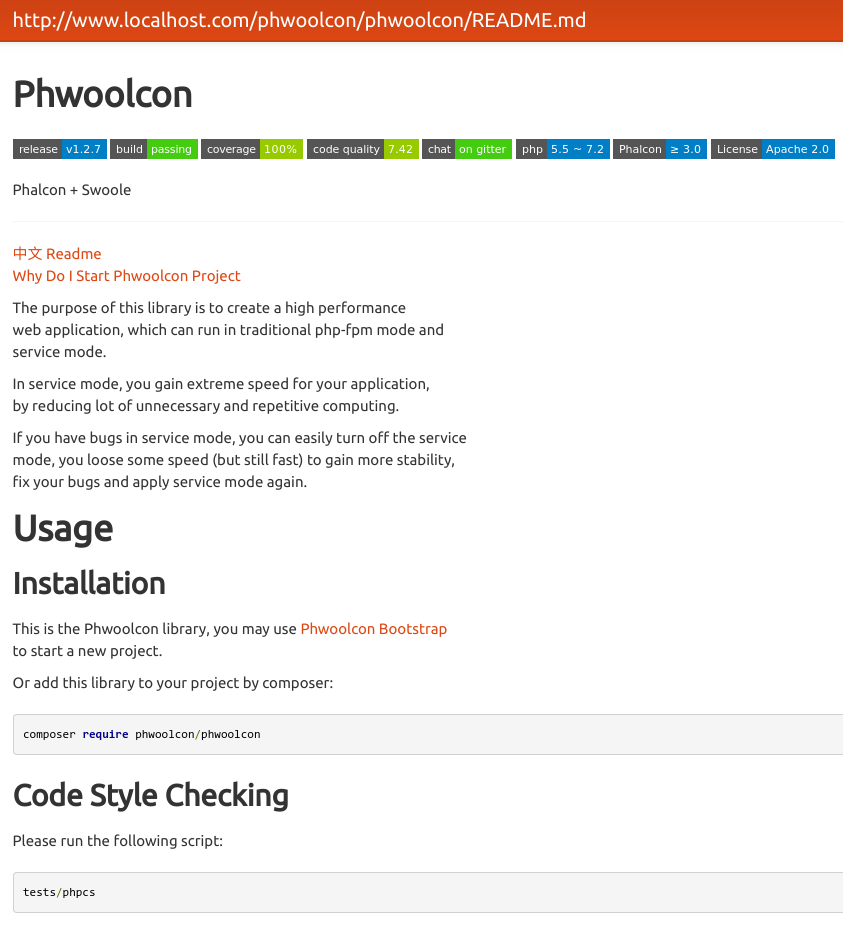

NGINX FancyIndex Theme
===

A prettier theme for nginx's `fancyindex` module, bundled with `strapdown.js` markdown renderer.

[Original README](https://github.com/TheInsomniac/Nginx-Fancyindex-Theme)

### Usage
- Install nginx with the `fancyindex` module
- Clone this repository to your web root with directory `.fancy`, e.g. `/srv/http/.fancy/`
- Include `fancyindex.conf` with full path in nginx `server` config, e.g.:
    ```nginx
    server {
        ...
        include /srv/http/.fancy/fancyindex.conf;
        ...
    }
    ```
- Restart nginx

### Screenshots
* PC View  
    

* Mobile view  
    

* Markdown renderer  
    
